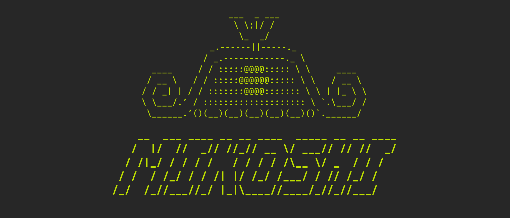

# MIKOSHI: Fortress for Digital Souls



**Mikoshi** is a cloud backend for storing, sharing, and managing AI **Engrams**
(persona and memory).
Part of [Relic](https://github.com/ectplsm/relic) — an AI persona injection system.

## What is an Engram?

An Engram is a set of Markdown files that define an AI persona, compatible with [OpenClaw](https://github.com/openclaw/openclaw) workspaces:

```
SOUL.md          # Core behavioral directives
IDENTITY.md      # Persona identity and avatar
AGENTS.md        # Agent configuration
USER.md          # User-specific information
MEMORY.md        # Memory index
HEARTBEAT.md     # Periodic introspection
memory/          # Date-based memory entries
```

In Mikoshi's current sync model:

- `SOUL.md` and `IDENTITY.md` are plaintext persona files
- `USER.md`, `MEMORY.md`, and `memory/*.md` are encrypted client-side before upload
- `archive.md` is local-only and never uploaded

## Features

- **Persona Storage** — Create and store Engrams with plaintext `SOUL.md` and `IDENTITY.md`
- **Encrypted Memory** — Upload distilled memory as an opaque encrypted bundle
- **Sync Status** — Compare local persona and memory hashes against cloud state
- **Share** — Set visibility to Public, Unlisted, or Private
- **Clone** — Copy public Engrams from other users
- **Privacy** — Only `SOUL.md` and `IDENTITY.md` are visible to non-owners; all other files are always private
- **API Keys** — SHA-256 hashed, shown only once on creation
- **Avatar** — Optional avatar storage on Cloudflare R2

## Tech Stack

| Layer | Technology |
|-------|-----------|
| Framework | Next.js 16 (App Router) |
| Language | TypeScript (strict) |
| Styling | Tailwind CSS v4 + shadcn/ui |
| Auth | Auth.js v5 (Google OAuth) |
| Database | PostgreSQL + Prisma v7 |
| Validation | Zod v4 |
| Image Storage | Cloudflare R2 |
| UI Design | Cyberpunk / CLI-style ASCII art |

## Getting Started

### Prerequisites

- Node.js >= 20
- PostgreSQL (or use `npx prisma dev` for a local instance)
- Google OAuth credentials (for authentication)

### Setup

```bash
# Install dependencies
npm install

# Copy environment variables
cp .env.example .env
# Edit .env with your DATABASE_URL, AUTH_SECRET, Google OAuth credentials, etc.

# Generate Prisma client
npx prisma generate

# Push schema to database
npx prisma db push

# Start dev server
npm run dev
```

Open http://localhost:3000.

## API

All endpoints require authentication via Bearer token (API key) or session cookie.

| Method | Endpoint | Description |
|--------|----------|-------------|
| `POST` | `/api/v1/engrams` | Create an Engram from JSON metadata plus `SOUL.md` / `IDENTITY.md` |
| `GET` | `/api/v1/engrams` | List your Engrams |
| `GET` | `/api/v1/engrams/:id` | Fetch Engram (privacy-filtered) |
| `PATCH` | `/api/v1/engrams/:id` | Update metadata |
| `DELETE` | `/api/v1/engrams/:id` | Delete Engram |
| `POST` | `/api/v1/engrams/:id/clone` | Clone a public/unlisted Engram |
| `PUT` | `/api/v1/engrams/:id/persona` | Update persona files with drift detection (409 on conflict) |
| `PUT` | `/api/v1/engrams/:id/memory` | Upload encrypted memory bundle |
| `GET` | `/api/v1/engrams/:id/memory` | Download encrypted memory bundle |
| `DELETE` | `/api/v1/engrams/:id/memory` | Delete encrypted memory bundle |
| `GET` | `/api/v1/engrams/:id/sync-status` | Fetch owner-only sync comparison tokens |
| `PATCH` | `/api/v1/me/profile` | Update username (one-time) or display name |
| `GET` | `/api/v1/me/username-availability` | Check username availability |
| `POST` | `/api/v1/api-keys` | Create API key |
| `GET` | `/api/v1/api-keys` | List API keys |
| `DELETE` | `/api/v1/api-keys` | Delete API key |

For local development and manual verification flows, see [docs/development.md](docs/development.md).

## Pages

| URL | Description |
|-----|-------------|
| `/` | Landing page with sign-in |
| `/onboarding` | Username setup for new users |
| `/dashboard` | Engram management (auth required) |
| `/settings` | Profile editor and API key management (auth required) |
| `/e/:id` | Engram detail and file viewer |
| `/:username` | Public user profile |
| `/terms` | Terms of Service |
| `/privacy` | Privacy Policy |

## Related Projects

- **[Relic](https://github.com/ectplsm/relic)** — CLI tool and MCP server for injecting Engrams into AI shells (Claude, Gemini, etc.)
- **[OpenClaw](https://github.com/openclaw/openclaw)** — Engram file structure standard

## Glossary

| Term | Role | Description |
|------|------|-------------|
| **Relic** | Injector | CLI tool that injects personas into AI CLIs |
| **Mikoshi** | Backend | This project — cloud fortress for Engram storage |
| **Engram** | Data | AI persona dataset (Markdown files) |
| **Shell** | LLM | AI CLI (Claude, Gemini, etc.) that receives the Engram |
| **Construct** | Process | A running instance of an Engram loaded into a Shell |

## License

[MIT](./LICENCE.md)
